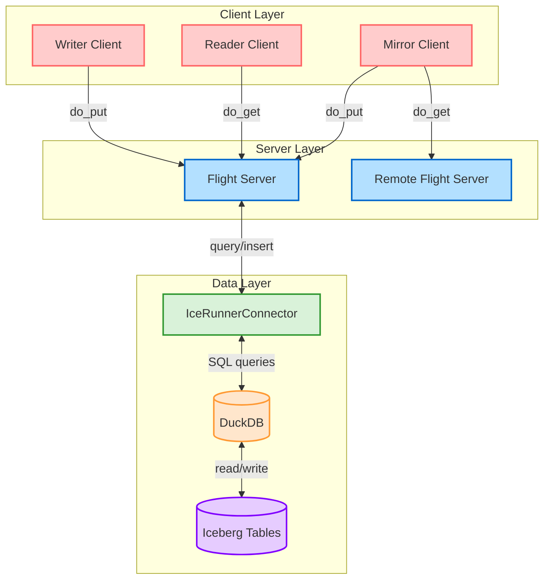

# IceRunner

IceRunner is a PyArrow Flight server implementation for Apache Iceberg tables. It provides a seamless way to read and write data to Iceberg tables using PyArrow Flight protocol.

## Features

- **Flight Server**: Exposes Iceberg tables through a PyArrow Flight interface
- **Concurrent Access**: Supports multiple readers and writers simultaneously
- **DuckDB Integration**: Uses DuckDB for efficient SQL queries on Iceberg tables
- **Strong Typing**: Full type support between PyArrow and Iceberg schemas
- **Simple CLI**: Easy-to-use command-line interface for server, reader, and writer operations
- **Flight-to-Flight Replication**: Sync data between Flight servers across regions or data platforms

## Installation

### Prerequisites

- Python 3.8+
- PyArrow 10.0.0+
- PyIceberg
- DuckDB

### Install Dependencies

```bash
pip install pyarrow pyiceberg duckdb
```

## Usage

IceRunner can be run in four modes:

### 1. Server Mode

Starts a Flight server that exposes Iceberg tables:

```bash
python -m icerunner serve -w /path/to/warehouse -p 8816 -n my_table
```

### 2. Reader Mode

Starts a client that continuously reads data from the server:

```bash
python -m icerunner read -p 8816 -n my_table -i 2
```

### 3. Writer Mode

Starts a client that continuously writes data to the server:

```bash
python -m icerunner write -p 8816 -n my_table -i 3
```

### 4. Mirror Mode

Starts a client that replicates data from a remote Flight server to a local Iceberg table:

```bash
python -m icerunner mirror -s grpc://remotehost:8815/source_table -n target_table -i 60
```

For a one-time sync instead of continuous replication:

```bash
python -m icerunner mirror -s grpc://remotehost:8815/source_table -n target_table --one-time
```

### Command Line Options

- `-w, --warehouse-path`: Path to the warehouse directory (default: "warehouse")
- `-p, --port`: Port for the Flight server (default: 8816)
- `-n, --table-name`: Name of the table to read/write (default: "icerunner_test")
- `-i, --interval`: Interval in seconds between operations (default: 1)
- `-s, --source`: Source Flight server URL for mirror mode (e.g., grpc://hostname:port/table)
- `-b, --batch-size`: Number of rows to process in each batch during mirroring (default: 1000)
- `--one-time`: Perform a one-time sync rather than continuous (for mirror mode)

## Architecture

IceRunner consists of these main components:

1. **IceRunnerConnector**: Manages the connection to Iceberg tables, handling schema conversion, table creation, and data operations.

2. **IceRunnerFlightServer**: Implements the PyArrow Flight interface, exposing endpoints for reading and writing data.

3. **Client Utilities**: Provides utilities for reading from and writing to the Flight server.

4. **Mirror Service**: Enables flight-to-flight replication between Flight servers and Iceberg tables.

### Architecture Diagram



### Data Flow

#### Standard Operation

```text
Writer → PyArrow Flight Client → Flight Server → IceRunnerConnector → Iceberg Table
Reader ← PyArrow Flight Client ← Flight Server ← IceRunnerConnector ← Iceberg Table
```

#### Flight-to-Flight Replication

```text
Remote Flight Server → Mirror Client → Local Flight Server → IceRunnerConnector → Iceberg Table
```

## Flight-to-Flight Replication

The mirror mode enables replication between Flight servers, allowing you to:

- Sync data between regions
- Migrate data between different storage systems
- Create local copies of remote datasets
- Build cross-platform data integration pipelines

### Features

- **Batch Processing**: Efficiently processes data in configurable batch sizes
- **Continuous or One-time**: Run as a continuous sync service or one-time migration
- **Automatic Table Discovery**: Can discover source tables if not explicitly specified
- **Schema Compatibility**: Handles schema translation between Flight and Iceberg formats
- **Robust Error Handling**: Continues operation even when errors occur
- **Progress Tracking**: Logs detailed progress and statistics

### Use Cases

1. **Multi-Region Replication**: Keep data synchronized across geographical regions
2. **Cloud Migration**: Migrate data from on-premises to cloud storage
3. **Data Integration**: Connect disparate data platforms
4. **Disaster Recovery**: Maintain backup copies of critical datasets
5. **Edge-to-Cloud Sync**: Replicate data from edge servers to central cloud storage

## Type Conversion

IceRunner automatically converts between PyArrow and Iceberg types:

| PyArrow Type | Iceberg Type |
|--------------|--------------|
| Int64        | LongType     |
| String       | StringType   |
| Timestamp    | TimestampType|
| Boolean      | BooleanType  |
| Float64      | DoubleType   |
| Float32      | FloatType    |

## Example

```python
# Start the server in one terminal
python -m icerunner serve

# In another terminal, start a writer
python -m icerunner write

# In a third terminal, start a reader
python -m icerunner read

# In a fourth terminal, mirror from another Flight server
python -m icerunner mirror -s grpc://otherserver:8815/remote_table
```

## License

This project is licensed under the MIT License - see the LICENSE file for details.
